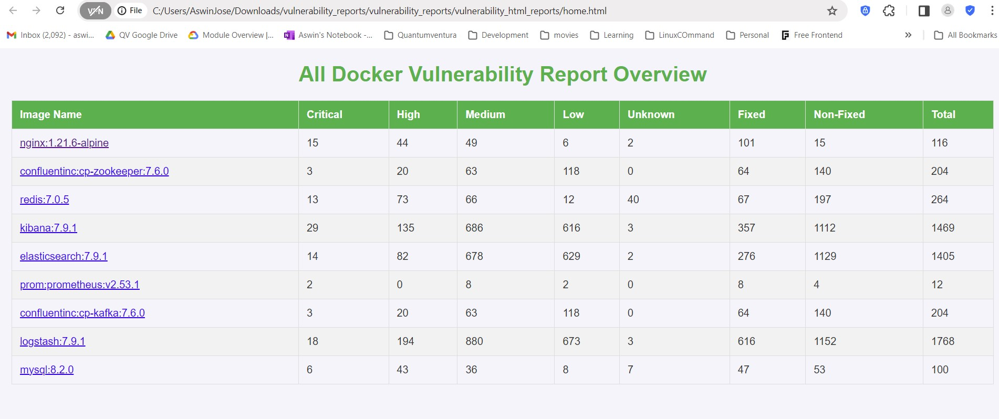
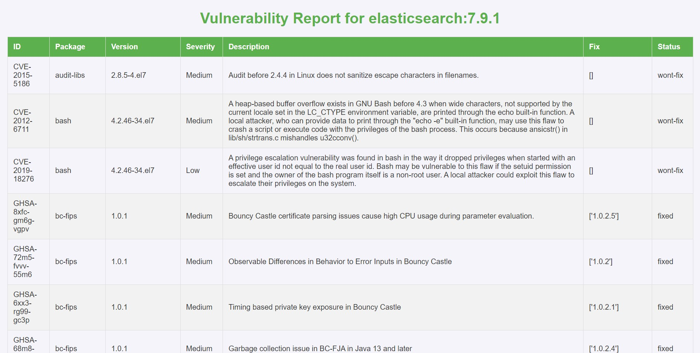

# Docker Image Vulnerability Scanning Script

## Overview

This Bash script automates the process of scanning Docker images for vulnerabilities using Grype. It checks for the presence of Grype and Python3, prompts for their installation if necessary, scans Docker images listed in a file, and generates both JSON and optional HTML reports.

## Features

- **Grype Installation Check**: Automatically checks for the presence of Grype and installs it if not found, with user permission.
- **Python3 Check**: Verifies if Python3 is installed, which is required for generating HTML reports.
- **Docker Image Scanning**: Scans Docker images listed in a specified file for vulnerabilities.
- **Report Generation**: Generates vulnerability reports in JSON format for each Docker image. Optionally converts these JSON reports into HTML.


## Prerequisites

- **Docker**: Ensure Docker is installed and running on your system.
- **Grype**: The script can automatically install Grype if it's not present.
- **Python3**: Required if you choose to generate HTML reports.

Tested environment details
 | Package | Version |
| ------ | ------ |
| Docker | 20.x.x |
| Docker Compose | 1.29.x |

## Usage

1. **Prepare Docker Images File**:
   - Create a file named `docker_images.txt` in the script directory, listing the Docker images you want to scan. Each image should be on a new line.

2. **Run the Script**:
   - Make the script executable:
     ```bash
     chmod +x scan_docker_images.sh
     ```
   - Execute the script:
     ```bash
     bash scan_docker_images.sh
     ```

3. **Script Interaction**:
   - The script will prompt for user input to install Grype if it's not already installed.
   - It will scan the Docker images listed in `docker_images.txt`.
   - The script generates JSON reports for each image in the `vulnerability_reports` directory.

4. **Optional HTML Report Generation**:
   - After scanning, the script prompts whether to generate HTML reports. If you choose "yes," ensure Python3 is installed. The script will then run a Python script (`generate_report.py`) to convert the JSON reports into HTML.

## Final Report

Find the final html report overview at the directory `cd vulnerability_reports/vulnerability_html_reports` and open the html file called `home.html`

Click on the image hyperlink to redict to vulnerability details


Here we clicked elasticsearch image hence we are showing elasticsearch vulnerability report in this page

